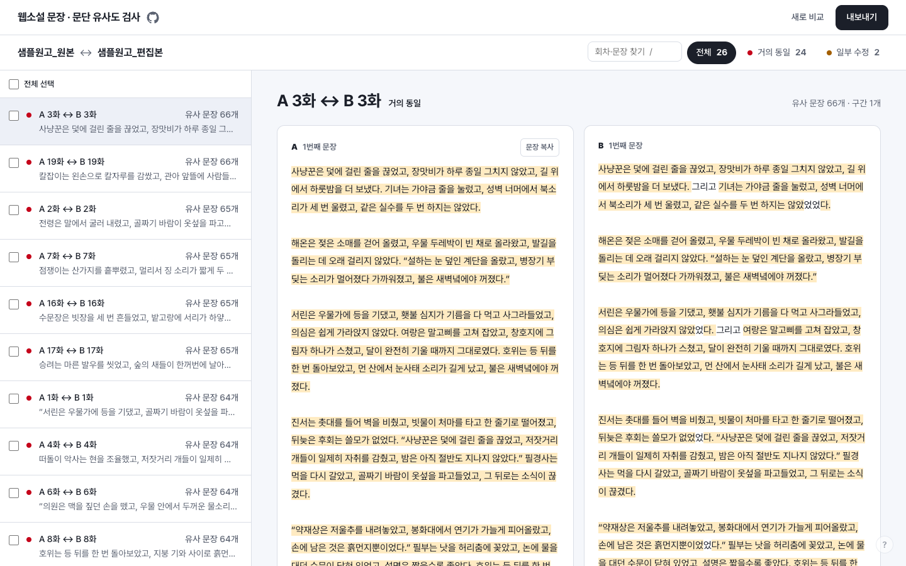
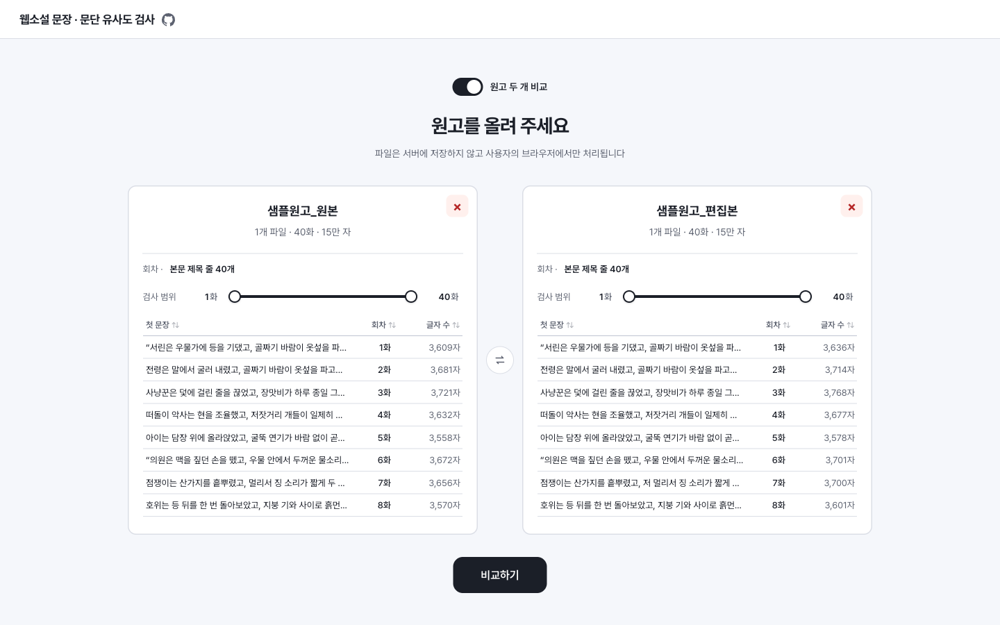
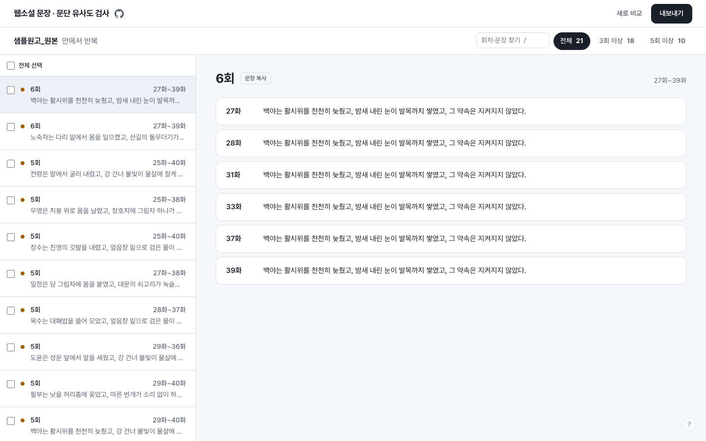
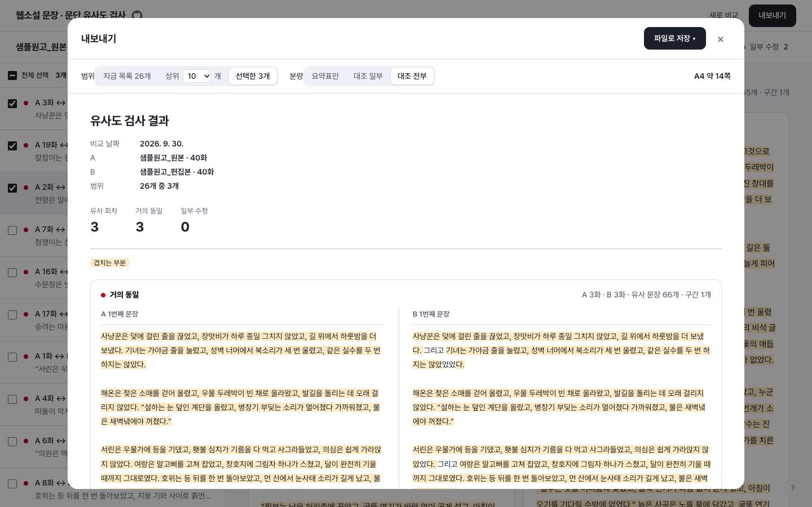
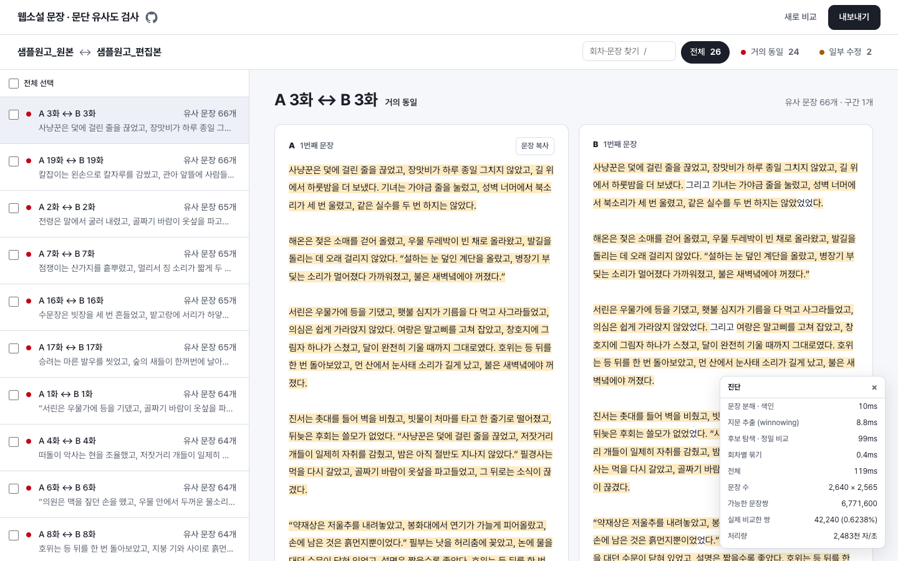

# 웹소설 문장 · 문단 유사도 검사

웹소설 원고 두 개를 비교해 **그대로 옮기거나 조금 고친 문장**을 찾아 주는 웹 도구입니다.
원고 하나만 넣으면 그 안에서 **여러 회차에 반복된 문장**을 찾습니다.

**바로 쓰기: https://jhste102lab.github.io/web-novel-similarity/**



- **원고는 어디에도 올라가지 않습니다.** 모든 처리가 브라우저 안에서 끝나고, 서버 · 로그인 · 저장 기능이 없습니다. 한 번 연 뒤에는 인터넷을 끊어도 동작합니다. 옛 한글 형식(HWP 5)을 읽는 기능은 페이지가 뜬 뒤 미리 받아 두므로 첫 한글 파일도 기다리지 않습니다.
- **입력:** `.txt`, `.docx`, `.hwp`, `.hwpx`. 파일 하나에 여러 회차가 들어 있어도 되고, 회차별 파일 수백 개를 한꺼번에 넣어도 됩니다. 확장자가 틀려도(`.hwp` 파일 이름이 `.hwpx`여도) 내용을 보고 엽니다. 암호가 걸린 한글 파일은 암호를 풀고 저장해 주세요.
- **빠릅니다.** 200만 자짜리 원고 두 개(500화 분량)를 몇 초 안에 끝내고, 검사하는 동안 찾은 결과부터 먼저 보여 줍니다.
- **의심되는 것만 보여 줍니다.** 흔한 표현이나 약한 유사는 결과에 넣지 않습니다. 퍼센트 점수도 없습니다.
- PC · 태블릿 기준입니다.

> 문자 유사도를 기준으로 한 참고 자료입니다. 표절 여부를 판정하지 않습니다.

## 사용법

원고가 없으면 [`docs/samples/`](docs/samples/)의 합성 예시 원고 두 개로 해 볼 수 있습니다. 편집본의 1~24화는 원본을 옮겨 조금씩 고친 것이고 25~40화는 다른 내용이며, 원본 25~40화에는 반복 문장을 심어 두었습니다. 아래 스크린샷도 이 파일들로 찍었습니다.

### 1. 원고 올리기



1. 처음에는 **원고 하나 안의 반복**을 찾는 화면으로 열립니다. 두 원고를 비교하려면 위쪽 **원고 두 개 비교** 스위치를 켭니다.
2. 카드를 눌러 파일을 고르거나, 파일이나 폴더를 끌어다 놓습니다.
3. 회차는 자동으로 읽습니다.
   - 본문에 `제12화`, `12화`, `[EP.12]`, `【12화】`, `Chapter 12`, `검은달 12화` 같은 제목 줄이 있으면 그 줄에서 회차를 나눕니다. 여러 회차를 묶은 파일(`1-100화.hwp`, `101-200화.hwp`)을 여러 개 넣어도 파일마다 제목 줄로 나눕니다. 첫 제목 앞의 글(프롤로그 등)은 첫 회차에 붙습니다.
   - 파일마다 한 회차씩이면 파일 이름의 마지막 숫자가 회차입니다. (`검은달_12화.txt` → 12화) 숫자가 없으면 이름순으로 1화부터 매깁니다.
   - 제목 줄이 없는 파일 하나면 회차 없이 문장 번호로 위치를 알려 줍니다.
   - 잘못 읽은 회차는 표에서 숫자를 눌러 바로 고칠 수 있습니다.
4. 일부 회차만 보고 싶으면 **검사 범위** 슬라이더로 좁힙니다.
5. **비교하기**(원고 하나면 **반복 찾기**)를 누릅니다. 결과는 찾는 대로 바로 나타나고, 중간에 멈추면 그때까지 찾은 결과가 남습니다.

맨 위 제목을 누르면 처음 화면으로 돌아갑니다. 올린 원고는 그대로 남고, 결과를 버려야 할 때는 먼저 물어봅니다. 원고나 결과가 있는 상태에서 새로고침하거나 창을 닫으면 브라우저가 한 번 더 확인합니다.

### 2. 결과 보기

- **왼쪽 목록**은 겹치는 **회차 쌍**입니다. (`A 3화 ↔ B 3화 · 유사 문장 66개`) 많이 겹친 순서로 정렬됩니다.
- 하나를 고르면 **오른쪽**에 두 원고의 해당 부분이 나란히 나오고, **두 원고에 똑같이 있는 부분에 색이 칠해집니다.** 거의 전부 칠해져 있으면 그대로 옮긴 것이고, 색이 빠진 곳이 고친 곳입니다.
- 위쪽 탭으로 등급별로 걸러 보고, 검색창에서 회차 번호나 문장으로 찾습니다.
- **문장 복사**를 누르면 A/B 문장이 함께 복사됩니다.

| 등급             | 뜻                                                              |
| ---------------- | --------------------------------------------------------------- |
| 거의 동일 (빨강) | 띄어쓰기나 조사 · 어미 몇 글자만 다른 문장                      |
| 일부 수정 (주황) | 단어를 바꾸거나 넣고 뺐지만 같은 문장을 고친 것으로 보이는 문장 |

`잠시 침묵이 흘렀다`처럼 여러 회차에 흔히 나오는 짧은 문장은 의심 대상이 아니므로 결과에서 뺍니다.

**키보드:** `j`/`k` 또는 `↑`/`↓` 이동 · `/` 찾기 · `x` 내보낼 결과 선택 · `c` 복사 · `d` 진단 · `?` 단축키 목록

### 3. 원고 하나 안의 반복



원고 하나만 올리면 여러 회차에 되풀이된 문장을 찾습니다. 같은 문장을 무심코 다시 쓴 곳을 찾을 때 씁니다. `3회 이상`, `5회 이상` 탭으로 자주 나온 것만 볼 수 있습니다. 한 문장이 나온 곳이 100곳을 넘으면 **외 N곳 더 보기**를 눌러 전부 펼칩니다.

### 4. 내보내기



오른쪽 위 **내보내기**를 누르면 보고서 미리보기가 열리고, PDF나 PNG로 저장합니다. 결과가 많으면 담을 것을 고릅니다.

- **범위:** 지금 목록(등급 탭과 검색 그대로) · 상위 10/50/100개 · 선택한 것만. 목록 왼쪽 체크박스로 고르며, **전체 선택**, 두 줄을 Shift를 누른 채 눌러 그 사이를 한꺼번에 고르기, `x` 키로 빠르게 고를 수 있습니다. 고른 것이 있으면 내보내기 창이 **선택한 N개**로 열립니다.
- **분량:** 요약표만 · 일부(구간마다 앞 3문장, 반복은 앞 3곳) · 전부(기본). 반복 보고서는 나온 곳마다 앞뒤 문장을 함께 보여 줍니다.
- 창 위쪽에 예상 쪽수(`A4 약 N쪽`)가 나옵니다. PNG는 너무 길면 여러 장으로 나눠 압축 파일 하나로 저장합니다.

### 진단



결과 화면에서 `d`를 누르면 단계별 시간과, 가능한 문장 쌍 가운데 실제로 비교한 비율이 나옵니다.

## 어떻게 찾나요

1. 원고를 문장으로 나누고, 문장마다 글자 5개 단위의 지문(winnowing)을 뽑습니다.
2. 지문을 하나라도 공유하는 문장 쌍만 후보로 골라, 편집 거리로 얼마나 같은지 잽니다. 200만 자 원고 두 개를 비교할 때 가능한 문장 쌍의 0.01%만 실제로 비교합니다.
3. 이어지는 유사 문장을 구간으로 묶고, 회차 쌍별로 정리해 등급을 붙입니다.

기준값은 직접 만든 합성 원고 벤치마크로 정했습니다. (`bench/`, `docs/benchmark.md`) 실제 원고는 저장소에 넣지 않습니다.

## 개발

Node 24 이상.

```sh
npm install
npm run dev     # 개발 서버
npm run build   # 정적 빌드 (dist/)
npm test        # 단위 테스트
```

원고 파일을 명령줄에서 바로 비교할 수도 있습니다.

```sh
node scripts/compare.ts A.txt B.txt   # A/B 비교
node scripts/compare.ts A.txt         # 원고 하나 안의 반복
```

`main`에 푸시하면 GitHub Actions가 lint · test · build를 거쳐 GitHub Pages에 배포합니다.

개발 · AI 에이전트용 문서는 영어로 작성되어 있습니다.

| 문서             | 내용                                         |
| ---------------- | -------------------------------------------- |
| `AGENTS.md`      | AI 에이전트 작업 규칙과 문서 안내            |
| `CONTEXT.md`     | 용어, 회차 인식 규칙, 확정된 제품 결정       |
| `docs/ssot/`     | 파일 지도 · 구조 · 워커 프로토콜 · 코딩 규칙 |
| `docs/adr/`      | 결정 배경                                    |
| `docs/README.md` | 문서 지도와 갱신 규칙                        |

## 라이선스

MIT
